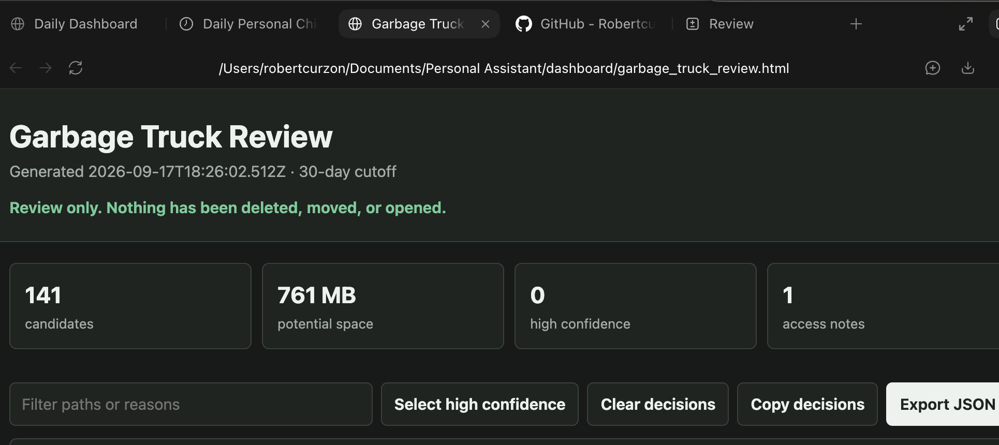
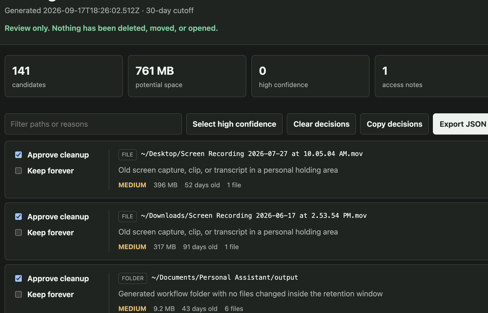

# Garbage Truck Review

A review-first file retention tool for finding old installers, temporary files, screenshots, recordings, media-production artifacts, generated outputs, and rebuildable dependency folders.

It generates a local checkbox review page. Nothing is removed during a scan, and approved cleanup is moved to a recoverable quarantine directory rather than permanently erased.



## What It Is For

Garbage Truck Review helps clean the accumulated junk on a personal computer without handing an automated cleaner permission to erase whatever it wants.

It is designed for files that often become useless after a while:

- Old app installers, downloaded archives, and duplicate setup packages
- Incomplete downloads and temporary files
- Screenshots, screen recordings, clips, and transcripts
- Old media-production inputs and generated renders
- Output folders left behind by one-off workflows
- Rebuildable folders such as `node_modules`, virtual environments, and test coverage

Candidates must be older than the configured retention period. The review queue shows higher-confidence items first and sorts larger items ahead of smaller ones within each confidence level, making the easiest disk-space wins visible early.

The tool does not try to decide whether a personal file is meaningful. Ambiguous items stay in the review queue for a human decision.

## Why

File cleanup tools tend to be either too manual or too eager. Garbage Truck Review separates discovery from deletion:

1. Scan metadata using conservative rules.
2. Review candidates in a local HTML page.
3. Mark items as **Approve cleanup** or **Keep forever**.
4. Export decisions.
5. Apply the exact reviewed decision file to a quarantine batch.



## Requirements

- Node.js 20 or newer
- macOS, Linux, or Windows
- No runtime dependencies

## Quick Start

```bash
git clone https://github.com/Robertcurzon/garbage-truck-review.git
cd garbage-truck-review
npm link
garbage-truck init
garbage-truck scan
```

Open `garbage-truck-report/index.html`, review the candidates, and export `garbage-truck-decisions.json`.

Apply only those reviewed decisions:

```bash
garbage-truck apply --decisions ~/Downloads/garbage-truck-decisions.json --confirm
```

Approved items are moved to `~/.garbage-truck/quarantine/`. The receipt records every source and destination path.

## Review Page Controls

Each candidate shows its path, reason, confidence, size, and age.

- **Approve cleanup:** Includes that item in the exported cleanup decision list. It does not delete or move the item immediately.
- **Keep forever:** Records that the item should be protected. Add accepted permanent exceptions to `keepForever` in the configuration so future scans skip them automatically.
- **Filter paths or reasons:** Narrows the visible list using text from the candidate path or cleanup reason.
- **Select high:** Checks every high-confidence candidate, such as stale installers and incomplete downloads. Review the selection before exporting.
- **Clear:** Removes all current checkbox decisions stored by the review page.
- **Copy:** Copies the current decision payload to the clipboard.
- **Export JSON:** Downloads the exact decisions used by the `apply` command.

Checkbox decisions are stored locally in the browser. They do not modify the scanned files.

## Setup In Detail

### 1. Install Node.js

Install Node.js 20 or newer from [nodejs.org](https://nodejs.org/) or your operating system's package manager.

Confirm the installation:

```bash
node --version
npm --version
```

### 2. Download and link the CLI

```bash
git clone https://github.com/Robertcurzon/garbage-truck-review.git
cd garbage-truck-review
npm link
```

`npm link` makes the `garbage-truck` command available from other folders on the computer. No third-party runtime packages are installed by this project.

### 3. Create a local configuration

```bash
mkdir ~/garbage-truck-home
cd ~/garbage-truck-home
garbage-truck init
```

Edit `garbage-truck.config.json` to choose the folders to scan, the retention period, generated-workflow markers, and any paths that must be kept forever.

### 4. Run the first scan

```bash
garbage-truck scan
```

Open `garbage-truck-report/index.html` in a browser. The scan reads metadata only and never moves files.

### 5. Review and export

Mark candidates using **Approve cleanup** or **Keep forever**, then click **Export JSON**. The downloaded decision file is a record of exactly what was reviewed.

### 6. Move approved items to quarantine

```bash
garbage-truck apply \
  --decisions ~/Downloads/garbage-truck-decisions.json \
  --confirm
```

Inspect the quarantine folder and cleanup receipt before permanently removing anything. Files can be restored by moving them back to their recorded source paths.

## Commands

### `garbage-truck init`

Creates `garbage-truck.config.json` in the current directory. Existing files are never overwritten.

### `garbage-truck scan`

Scans configured roots and writes:

- `index.html` - checkbox approval queue
- `review.json` - structured scan evidence
- `review.md` - text summary

Options:

```bash
garbage-truck scan --config ./my-config.json
garbage-truck scan --now-iso 2026-09-17T12:00:00Z
```

### `garbage-truck apply`

Moves exported cleanup approvals into quarantine. It refuses changed reports, protected paths, excluded paths, and symbolic links.

```bash
garbage-truck apply \
  --decisions ./garbage-truck-decisions.json \
  --confirm
```

Use `--quarantine /path/to/folder` to choose another quarantine root.

## Confidence Levels

- **High:** stale installers, archives, partial downloads, and temporary files.
- **Medium:** old screenshots, recordings, clips, transcripts, generated outputs, and dated media-production folders.
- **Low:** rebuildable dependency folders such as `node_modules` and virtual environments.

Confidence is a review aid, not a guarantee that an item is useless.

## Configuration

See [`garbage-truck.config.example.json`](garbage-truck.config.example.json).

Important settings:

- `retentionDays`: minimum age before an item can become a candidate.
- `roots`: folders to scan.
- `keepForever`: permanent path exclusions with reasons.
- `neverScan`: boundaries the scanner must not enter.
- `generatedPathMarkers`: path fragments identifying generated workflow areas.
- `outputDirectory`: local report destination.

`~` and relative paths are supported. Relative paths resolve from the configuration file's directory.

## Safety Model

- Metadata only: names, paths, sizes, types, and timestamps.
- Symbolic links are skipped.
- Protected paths are excluded during scan and rechecked during apply.
- Reports are local and ignored by Git.
- `scan` never deletes, moves, or modifies candidates.
- `apply` requires both an exported decision file and `--confirm`.
- Quarantine preserves the original path structure and supports manual recovery.

## Development

```bash
npm test
npm run check
```

## License

MIT
